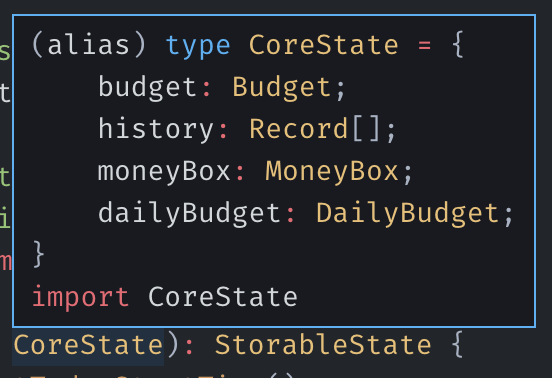
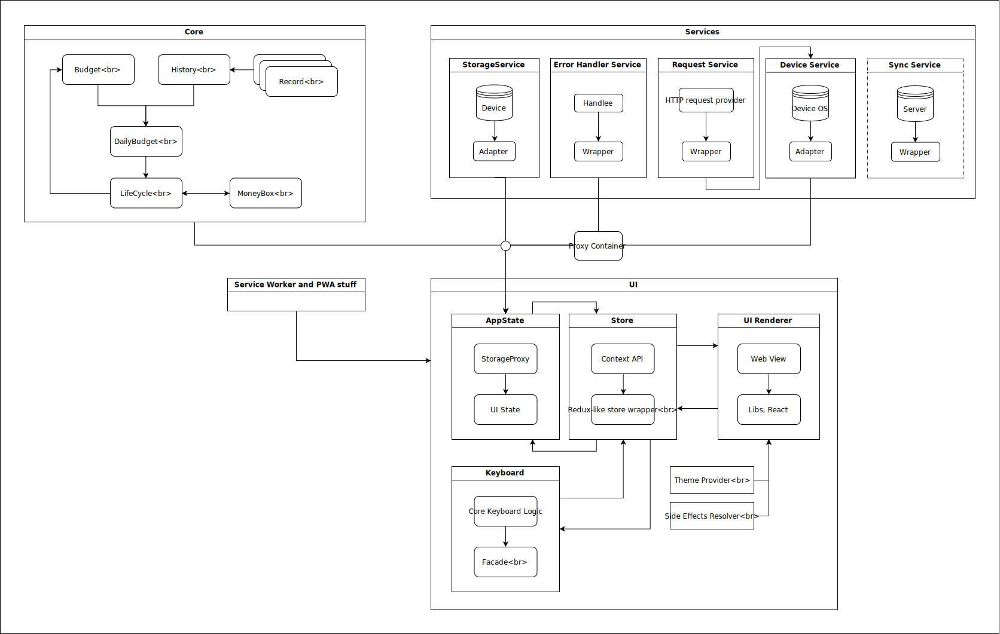

# Tzlvt. Why Rewrite in TypeScript

I've wanted to rewrite [Tzlvt](/projects/tzlvt/) for a long time. It's not a matter of “Oh, I learned the new stuff, let's put it everywhere.” No, it's just maintaining the code base as it was has become too expensive.

## Why Maintenance Became Expensive

There were several reasons to it.

### No Tests

Because of this, any change in the code could lead to anything. Yes, green tests do not guarantee that there are no bugs at all, but they help rule out bugs that are already found.

### No Robust Architecture

The first version of the app [I wrote it in 2 weeks](/blog/tzlvt-how-design-principles-affect-development/), there was no time for architecture. (Oh, that startup spirit!) In a good way, after the launch I should have taken a couple of weeks and refactored everything there, but something (everything?) went wrong.

### No Documentation

Good docs would remind you how the app works, and why it works the way it does. Tzlvt would seem to be a small application, “there's not much to remember”, but no! It isn't the project I work on constantly. I work with it from time to time and the nuances can be easily forgotten.

All this led to the fact that it became too expensive to maintain the application. It took more time to implement new features, the process became less fun, and the burning under the loins of the situation got worse.

And then in 2019, it happened. I was finally began to think about how I could change it.

## How I Could Change It

It was clear to me that if I started fixing the situation, I would be haunted by two thoughts.

### Why Waste Effort on Something That Has Already Been Done?

Actually, it's a reasonable idea—it's really not cost-effective to rewrite for the sake of rewriting. I wanted to find additional incentives and interest for myself. The interest was the technical limitations I invented for myself and the attempt to manage the development process. And in the future, perhaps—the resuscitation of Tzlvt as a project.

**Technical constraints**. It's like a problem with a star in the textbook. It's like there is not much sense in it, but you want to show off and hit some extra dopamine, that's all.

**Development Management**. I wanted to try transferring experience, looking at the development process in a broader way, to get into the supersystem. I had in mind two people who wanted and could help: [Viktor Demin](https://github.com/Chakalaka11) and [Fedor Kuznetsov](https://github.com/Vostenzuk). In fact, with them we started this whole carnival.

**Project Reanimation**. It's not that I counted on it, this point was more of a bonus. Fewer expectations are better. However, the project [came to life](https://t.me/kkonstantinopolskiy/277) after all.

### Make No Harm!

The highest priority in this whole endeavor is for users to feel better (at least, not worse). This meant that I could not roll out an incomplete application. By “incomplete” I meant an app in any form worse than the one that was already on the users' phones.

That is, I couldn't remove some functionality that was already working. I couldn't just cut a feature out for no reason at all, there had to be a good reason for it. And of course, I could not screw up the user's data. (If something went wrong, please write to [support@fuckgrechka.ru](mailto:support@fuckgrechka.ru).)

All of this threatened to paralyze the project, because it would start to seem too big. The guys and I decided not to “pack it in startup-style,” but to give ourselves an infinite amount of time. That's as much time as it takes to write properly, hurrying is not allowed.

Next, we had to determine the stack and the technical constraints.

## Stack and Technical Constraints

I didn't want to leave React. I still hadn't made friends with Angular, and I felt like Vue was still raw for some reason. So, we kept the React.

One of the technical constraints was the minimum number of dependencies and the size of the bundle. The second was the lack of classes: we only have functional components.

The second really makes you think about separating business logic from the UI logic. Hooks helped not to smudge the logic over the lifecycle of components, but to collect it in one function.

The last (although determining the whole course of development) constraint was the choice between JS and TS. Let me tell you why we chose TipScript.

## Why We Chose TypeScript

I wanted normal types, not `0 !== '0'` and all that. I wanted to design like a normal person, not write tons of `jsdoc` for each function. I wanted the code itself to say what it did, instead of hiding behind comments that would get out of date anyway and then you'd have to guess what to believe. TypeScript has all this to some extent.

### Types

Yes, assigning a variable of type `string` to a variable of type `number` won't work anymore—and that's fine! Because outside of the classic sandbox-todo-stuff, I won't confuse `string` and `number`, but rather data structures and entities. And if an editor tells me: “Honey, you should just have `Record` here, not `Spend`”, I'm all in.

The feedback loop is tighter than with JS, because TS checks my code while I'm writing it, and I'll see the error much earlier.

### Automatic Documentation

The perfect documentation is the one [which does not exist and its function is performed](https://en.wikipedia.org/wiki/TRIZ). Types, interfaces, and function signatures are such documentation.

We, humans, [use names to refer to phenomena and entities](https://janmolak.com/4680177f026e) because it makes it easier for us to think that way. When entities in the code are named according to the subject area, the code becomes easier to read.

Also, TypeScript allows to use type aliases for primitives. For example, `DayStartTimeStamp` is the type that describes a UTC timestamp that refers to a particular date start time.

This is an alias for a regular `number` but its name's much clearer. I could have specified somewhere in a comment that `startDate` is specified in milliseconds by UTC... but if I have a way to specify it directly in the code, I better do so.

Code covered by types, aliases, and interfaces can be written as a sentence. Here is a function that checks to see if the passed record is within a given time interval.

And this is how this function is then used:

Understanding this code is then faster and less stressful because of the clearer intent.

### Architecture

This paragraph is an ode to interfaces. Designing system using abstractions is much simpler and so much more robust.

Interfaces help you think through the relationships between entities. It's so awesome that in the first couple of days I didn't write a single line of product code—just interfaces, types, and function signatures.

### Tests and Refactoring

For development, we chose the [TDD methodology](https://ttt-tdd.bespoyasov.ru/). Here TypeScript also came in handy, because having types and interfaces it's easier to create (or generate, whichever you prefer) stubs and mocks.

The coolest thing about refactoring is using [built in IDE tools](https://code.visualstudio.com/docs/editor/refactoring): _rename symbol, extract function_ etc. I don't have to worry if I renamed all the entities in the project—the IDE takes care of that. My job is to find the right name, then let the robots sweat.

### Drawbacks

The biggest disadvantage of TypeScript is that it takes time. A lot of. Extra. Time.

It will be spent to cover functions and methods with types, to type all arguments, to understand why some type doesn't work for method from third party library. (Here comes the joke about “You can't just go ahead and write a quick draft of a function without using `any`.”)

The second disadvantage, a little smaller, is that not every library has a type definition for TypeScript in [_DefinitelyTyped_](https://github.com/DefinitelyTyped/DefinitelyTyped). The basic packages have them, of course, but there may be no definitions for lesser-known libraries. For example, for [_clsx_](https://github.com/lukeed/clsx) it wasn't there.

If you've spent 5 hours to cover third-party API types, you understand the pain.

## Okay, But When's the Update?

It's already in production 🙃

- If you are using the [web version](https://www.fuckgrechka.ru/tzlvt/app/), it is likely that the app on your phone has updated itself.
- An update [for Android](https://play.google.com/store/apps/details?id=ru.bespoyasov.tzlvt&hl=ru) appeared in the store a couple of weeks ago.
- An update [for iOS](https://apps.apple.com/ru/app/tzlvt/id1093713971) will appear quite soon.

The upgrade should have gone smoothly and without any data losses, but, please, [email us](mailto:support@fuckgrechka.ru) in case we broke something along the way after all.

## Resources

- [Tzlvt](/projects/tzlvt/)
- [Tzlvt. How Design Principles Affect Development](/blog/tzlvt-how-design-principles-affect-development/)

### The App

- [Tzlvt as PWA](https://www.fuckgrechka.ru/tzlvt/app/)
- [Version for Android](https://play.google.com/store/apps/details?id=ru.bespoyasov.tzlvt&hl=ru)
- [Version for iOS](https://apps.apple.com/ru/app/tzlvt/id1093713971)

### Team

- [Viktor Diomin](https://github.com/Chakalaka11)
- [Fedor Kunetsov](https://github.com/Vostenzuk)

### Some Tech Stuff

- [Refactoring Tools in VS Code](https://code.visualstudio.com/docs/editor/refactoring)
- [Theory of Inventive Problem Solving](https://en.wikipedia.org/wiki/TRIZ)
- [After two years with TypeScript – was it worth it?](https://ecom.software/en/after-two-years-with-typescript-was-it-worth-it/)
- [Tiny Types in TypeScript](https://janmolak.com/4680177f026e)
