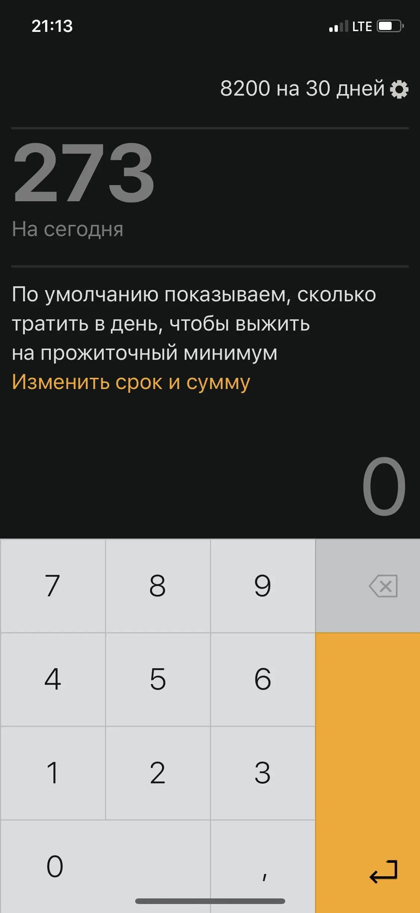
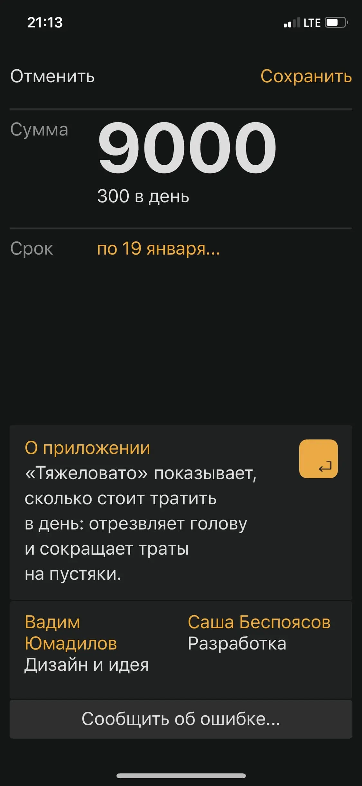
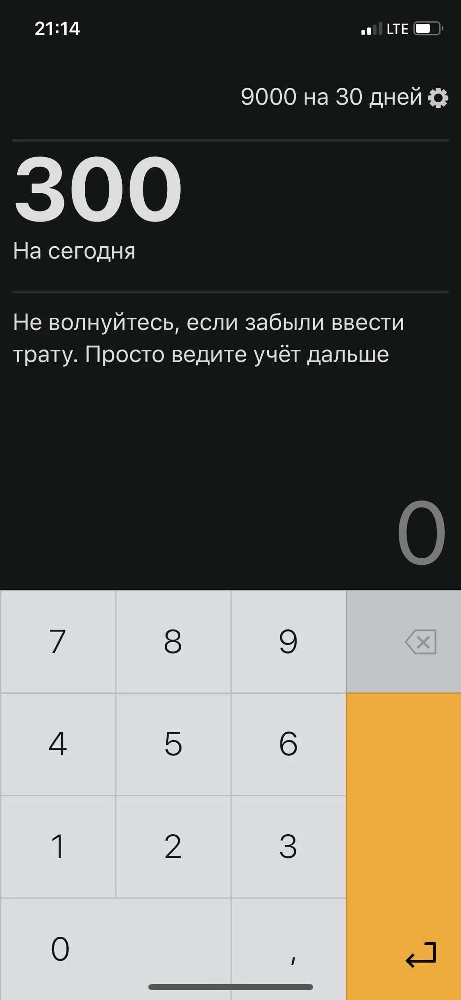
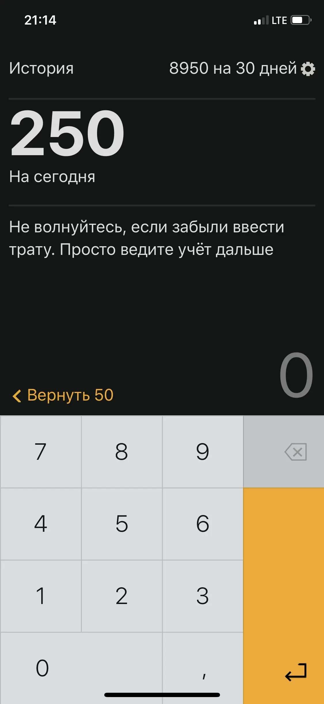
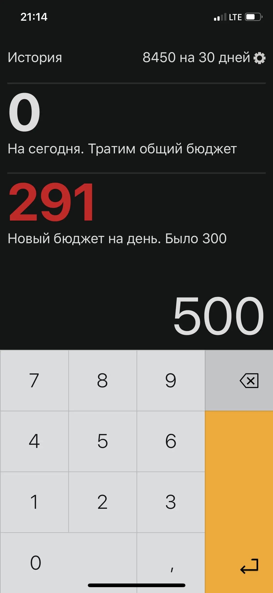
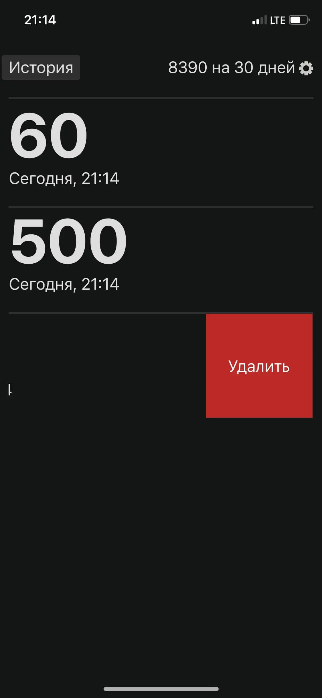

# Tzlvt Release

Today we're launching [Tzlvt](http://mstryshk.in/tzlvt/), a web app for situations where you need to survive to your paycheck. You enter a budget and a number of days you need to live through, and the app shows you how much to spend per day.

The web version of the app works on a slot connection and without internet at all. Save the bookmark to your phone desktop and use it like a regular app. Or download the app from the AppStore or Google Play.

At first start, the app shows you how much you need to spend to survive on a minimal wage.

On the settings screen, you can change the money amount and the date.

The daily budget will be then recalculated. Along with the daily budget, we show hints and tips.

When entering a spending, the app shows how much money is now left. This way you can see right away how the daily budget is decreasing, this encourages saving. If the spending was accidental, it can be quickly canceled.

If you spend all of the money for the day, the app will deduct it from the total budget and recalculate the limit for the next days. This does not limit the user in spending and does not drive them into a “debt”, but it shows that you might need to spend more carefully.

All expenses are recorded in the history, from where you can delete them by swiping to the left. The history will tell if the user has spent money on something if they forget.

Start using:

- [Download for iOS](https://apps.apple.com/en/app/tzlvt/id1093713971)
- [Download for Android](https://play.google.com/store/apps/details?id=ru.bespoyasov.tzlvt)
- [Use Web Version](http://mstryshk.in/tzlvt/app/)

Blog posts about the development process:

- [How Design Principles Affect Development](/blog/tzlvt-how-design-principles-affect-development)
- [Native vs Web](/blog/tzlvt-native-versus-web)
- [Why Rewrite in TypeScript](/blog/tzlvt-architecture-upgrade)
- [“Black Screen of Death” Post-Mortem](/blog/tzlvt-upgrade-post-mortem)

App mentions in media:

- [TJournal](https://tjournal.ru/23937-moskovskii-dizainer-vipustil-prilozhenie-tyazhelovato-dlya-snizheniya-rashodov)
- [Secretmag](https://secretmag.ru/news/2016/02/29/money)
- [VC](https://vc.ru/n/tyazhelovato-app)
