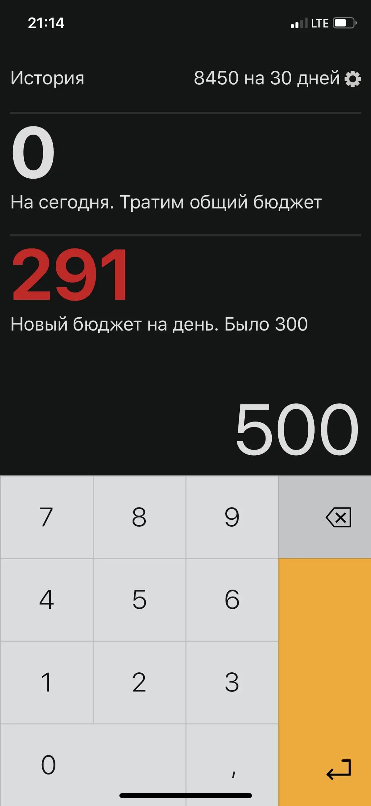
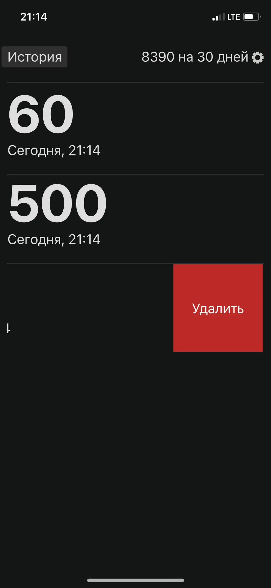

# Запускаем «Тяжеловато»!

Сегодня мы запускаем [«Тяжеловато»](https://fuckgrechka.ru/tzlvt/) — это веб-приложение для ситуаций, когда надо дотянуть до зарплаты. Вы вводите бюджет и срок, а приложение показывает, сколько тратить в день.

Веб-версия приложения работает при медленном интернете и без него. Сохраните закладку на рабочий стол и пользуйтесь им, как обычным приложением. Или скачайте приложение из магазина для iOS и Android.

При первом заходе мы показываем, сколько нужно тратить, чтобы выжить на прожиточный минимум.

На экране настроек пользователь изменяет срок и сумму.

Бюджет на день пересчитается. Вместе с дневным бюджетом мы показываем подсказки и советы.

При вводе траты приложение показывает, сколько денег останется. Так пользователь видит, что сумма на день уменьшается, это стимулирует экономить. Если трата была случайной, её можно быстро отменить.

Если истратить все сегодняшние деньги, то мы будем вычитать из общего бюджета и пересчитаем лимит на следующие дни. Это не ограничивает пользователя в тратах и не вгоняет «в минус», но показывает, что надо тратить осторожнее.

Все расходы записываются в историю, откуда их можно удалить свайпом влево. История подскажет, тратил ли пользователь деньги на что-то, если он забудет.

Начать использовать:

- [Версия для iOS](https://apps.apple.com/ru/app/tzlvt/id1093713971);
- [Версия для Android](https://play.google.com/store/apps/details?id=ru.bespoyasov.tzlvt&hl=ru);
- [Веб-версия](https://www.fuckgrechka.ru/tzlvt/app/).

Заметки в блоге о процессе разработки:

- [Как принципы повлияли на разработку](/blog/tzlvt-how-design-principles-affect-development);
- [Натив против веба, 5:2](/blog/tzlvt-native-versus-web);
- [Как и зачем мы переписали Тяжеловато на Тайпскрипт](/blog/tzlvt-architecture-upgrade);
- [Чёрный экран смерти в Тяжеловато, отчёт об инциденте](/blog/tzlvt-upgrade-post-mortem).

Упоминания в СМИ:

- [TJournal](https://tjournal.ru/23937-moskovskii-dizainer-vipustil-prilozhenie-tyazhelovato-dlya-snizheniya-rashodov);
- [Lenta](https://lenta.ru/news/2016/02/29/tyazhelovato/);
- [VC](https://vc.ru/n/tyazhelovato-app);
- [Secretmag](https://secretmag.ru/news/2016/02/29/money).
