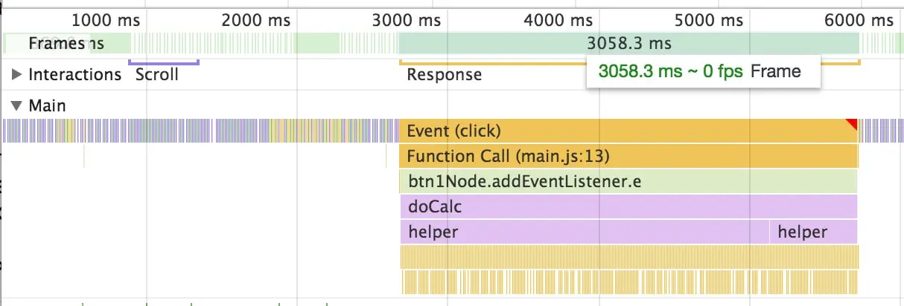
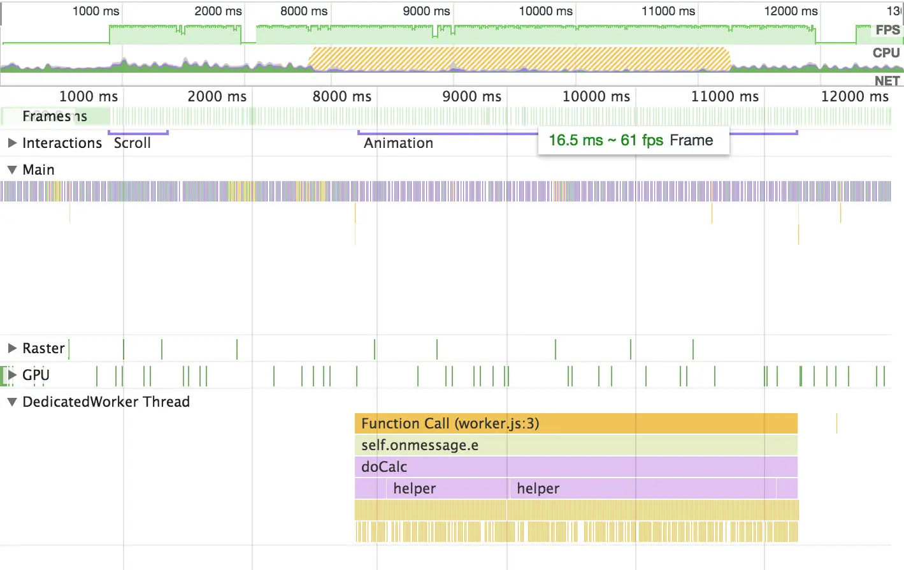
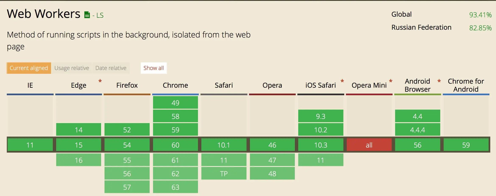

# Используем веб-воркеры для улучшения производительности

О сервис-воркерах слышали все. А вот когда разговор заходит о веб-воркерах, часто я встречаю вопрос «А что это?». В этом посте расскажу подробнее, что это такое и когда эту технологию стоит использовать.

## Что за зверь

Веб-воркер — штука, которая умеет выполняться в браузере параллельно с основным скриптом. А значит — выполняться, не блокируя отрисовку страницы. Проще говоря, если запустить что-то тяжёлое в основном скрипте, то страница будет тормозить, а если в веб-воркере — то не будет.

## Что нужно знать перед началом

- Джаваскрипт всё-таки однопоточный, поэтому если мы хотим запустить какую-то задачу параллельно, то она должна лежать в отдельном файле.
- Веб-воркер не имеет доступа ни к DOM-дереву, ни к объекту _window_. Напрямую к локальному хранилищу обратиться внутри него тоже нельзя. Всё потому, что работа с DOM-деревом и локальным хранилищем — последовательная, а веб-воркер работает параллельно.
- Общаться с веб-воркером придётся через сообщения, которые нужно пересылать между ним и основным скриптом. Но стоит учитывать, что передача объектов по ссылке внутрь воркера не сработает, объекты будут скопированы перед отправкой.

## API

У веб-воркеров простое API. Чтобы проверить, поддерживается ли технология браузером:

```js
if (window.Worker) {...}
```

Чтобы создать воркер:

```js
const worker = new Worker('./path/to/file.js');

// Путь должен быть прописан относительно html-файла,
// в котором подключается основной скрипт
```

Чтобы отправить сообщение из основного скрипта в воркер:

```js
worker.postMessage({ key: 'value' });
```

Чтобы подписаться на сообщение внутри воркера:

```js
self.onmessage = (e) => console.log(e);

// `self` — глобальный объект внутри воркера,
// как `window` в основном скрипте
```

Чтобы отправить сообщение из воркера в основной скрипт:

```js
self.postMessage({ key: 'value' });
```

И чтобы подписаться на сообщение от воркера в основном скрипте:

```js
worker.onmessage = (e) => console.log(e);
```

## Пример

[Я написал небольшой пример](https://github.com/bespoyasov/web-worker-example), где запустил сложные вычисления вначале в основном скрипте, а затем в веб-воркере. После этого сравнил, как ведёт себя анимация, с помощью отладчика в Хроме.

Вначале попробовал сделать анимацию без CSS-трансформаций, чтобы результат был нагляднее. Получилось так.

Без применения веб-воркера анимация стопорится, и FPS падает до 0. Так происходит потому, что процессор занят сложной задачей. На скриншоте видно, сколько места занял _response_ — это вычисления:



Веб-воркер выполняется параллельно, поэтому анимация в среднем держится на уровне 60 FPS. На скриншоте видно, что вычисления теперь выполняются отдельно:



Результат для анимации без CSS-трансформаций видно и невооружённым глазом. [Попробуйте покликать](https://bespoyasov.ru/showcase/web-workers-for-better-performance/) на разные кнопки сами.

CSS-трансформации спасают положение, страница становится отзывчивее, а анимация глаже. Но даже с ними при чуть больших нагрузках FPS падает до 45–50. С веб-воркером FPS стабильно держится на 60.

## Зачем это

Выносить сложные вещи в отдельный скрипт кажется чем-то надуманным, пока не столкнёшься с обработкой потоковых данных, больших текстов или чисел в браузере. На одном из проектов нашей команде потребуется анализ текста на клиенте, поэтому мы думаем в сторону веб-воркеров.

## Кто уже использует

[Покедекс](https://www.pokedex.org) использует веб-воркер для обзора изменений в _shadow DOM_. Из-за этого приложение плавно скроллится и работает без подмерзаний даже на старых телефонах.

## И на сладкое

Веб-воркеры поддерживаются всеми браузерами, кроме Оперы Мини. Они работают даже в 11-м IE:



Поэтому пользуйтесь, классная же технология 🙃

## Доп. материалы

- [Пример работы приложения](https://bespoyasov.ru/showcase/web-workers-for-better-performance/)
- [Исходники на Гитхабе](https://github.com/bespoyasov/web-worker-example)

### Немного теории

- [Спецификация на _w3_](https://www.w3.org/TR/workers/)
- [Статья об использовании технологии на _MDN_](https://developer.mozilla.org/ru/docs/DOM/Using_web_workers)
- [Туториал на _html5rocks_](https://www.html5rocks.com/en/tutorials/workers/basics/)
