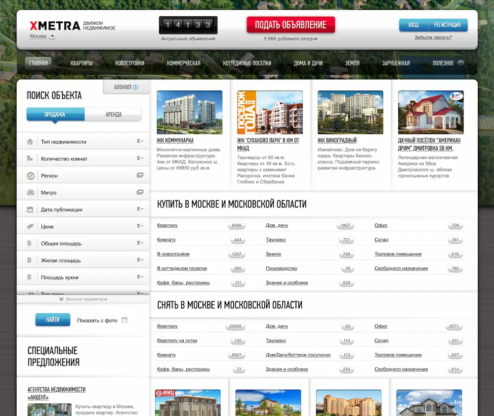
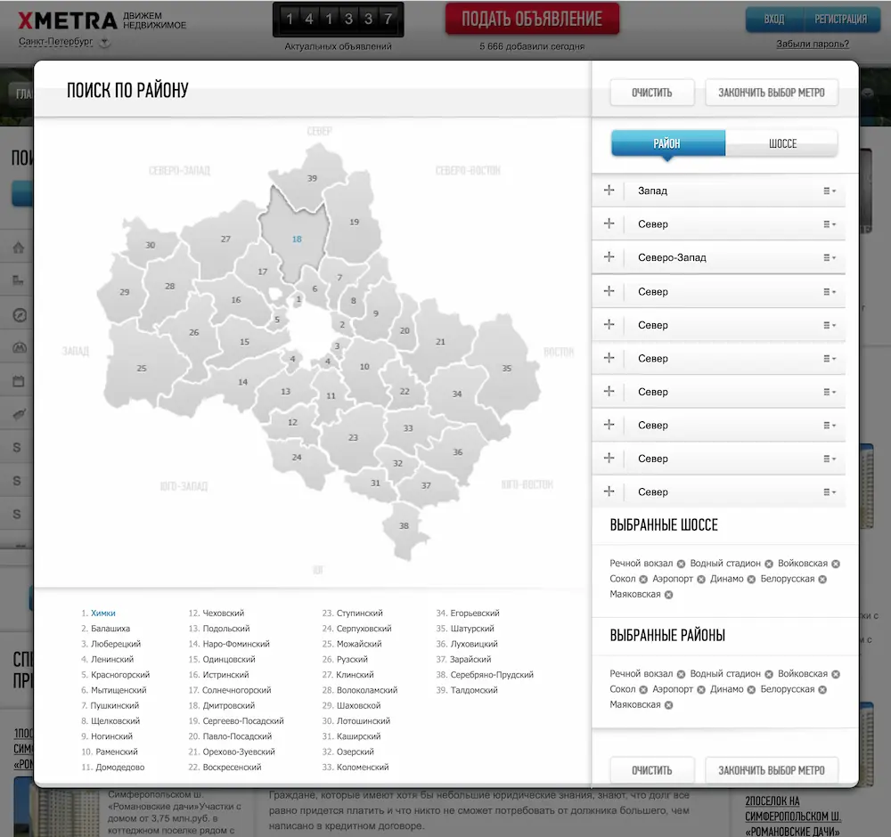

# Xmetra. First Big Project

Xmetra is a real estate search portal that was recently launched and the first really big project I took part in.

Out of 5 months for development, it took one and a half months for building the UI. There were a lot of design mockups, each one had a lot of non-standard and hardly recognizable to the eye details: gradients, shadows, button highlights, etc.

There were a lot of elements with complex UI logic. For example, the search for apartments by city district required interaction with the server to update the data on the page via AJAX.

By the way, working on this very project, I learned how to use git 🙃
