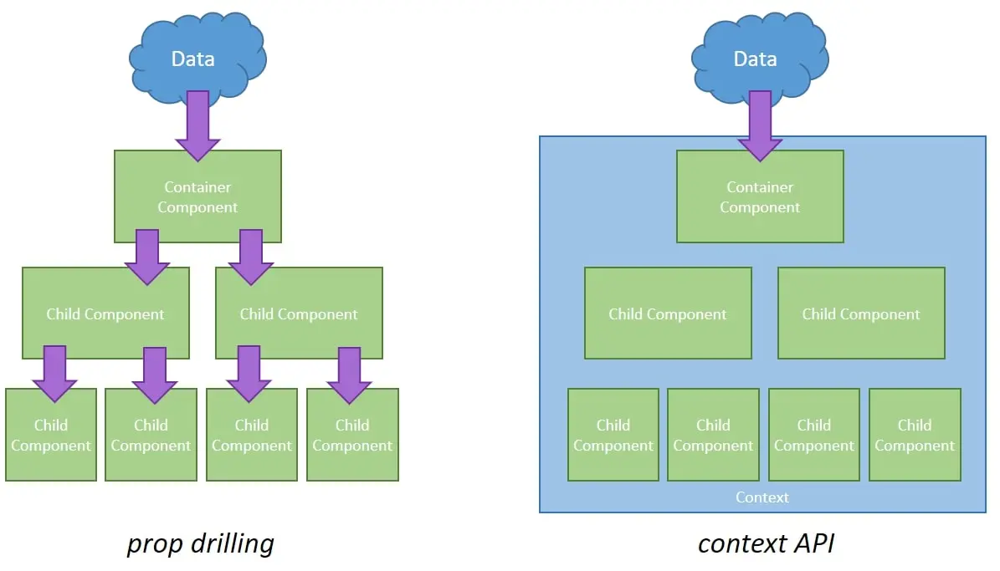
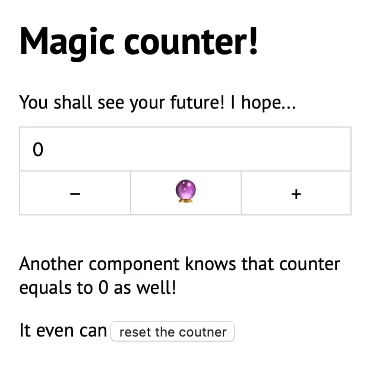

# From Redux to Hooks?

In React version 16.7.0, they released [Hooks](https://reactjs.org/docs/hooks-reference.html). These are APIs that allow you to use a local state without using classes. And among them, there is one that I think can replace Redux.

In this article, I assume you know the difference between functional components and classes, are aware of the local-state and component lifecycle, and how Redux works. Without that, it would be hard to get into, but I couldn't fit everything into one article.

## What Hooks?

Previously, to use a state in a component, you had to use a class. Hooks allow you to use the state in functional components without using classes.

For example, here we use the `useState` hook to create and use the `counter` variable:

```js
import React, { useState } from 'react';

const SimpleComponent = () => {
	const [counter, setCounter] = useState(0);
	// The first time, the counter value will be equal to what we pass to `useState`,
	// then the value we set with `setCounter`.
	return <div>{counter}</div>;
};
```

`useState` returns a tuple of a value and a function that will update that value.

Due to the fact that several hooks can be used in one component, they have [restrictions and rules](https://reactjs.org/docs/hooks-rules.html). More about this you can find [in the documentation](https://reactjs.org/docs/hooks-rules.html) and in the [talk at React Conf](https://www.youtube.com/watch?v=V-QO-KO90iQ).

## `useReducer`

`useReducer` is a hook that is similar in principle to the reducers from [Redux](http://redux.js.org/).

```js
const App = () => {
	const [state, dispatch] = useReducer(reducer, initialState);
	// `initialState` — the initial value for the state;
	// `reducer` — function that takes state and action and handles state changes;
	// `state` — current state value;
	// `dispatch` — function that will call the actions to update the state.

	return <div>Hello world</div>;
};
```

In principle, this _is_ Redux. The only problem is that the `state` and `dispatch` variables are inside the scope of the `App` function, which means we can't use the reducer in other components.

...Unless we use context.

## Context API

To solve the problem that different components have to share a common state, we can use the state of the root component and proxy it down the tree.

This works, but if the tree is big, we have to pass the data through each nesting level. This results in so-called _prop drilling_. Schematically it looks like in the [picture](https://www.carlrippon.com/playing-with-the-context-api-in-react-16-3/) on the left:



In addition to working with state, Redux solved this problem too. With it, we create just one repository that can be accessed by any component. That way we don't have to wade through the whole tree.

The same problem is solved by the context in React. We create a context, use the provider to specify what you want to store and pass, and use the consumer to specify in which component you want to fetch and use those values:

```js
import { createContext } from 'react';
// Create context:
const StoreContext = createContext();

const App = () => (
	// Specify a value through the provider in the value property,
	// which we need to store and somehow use in other components:
	<StoreContext.Provider value={{ meaningOfLife: 42 }}>
		<OtherComponent />
	</StoreContext.Provider>
);

const OtherComponent = () => {
	// Access the value through the consumer:
	return (
		<StoreContext.Consumer>
			{({ meaningOfLife }) => <div>{meaningOfLife}</div>}
		</StoreContext.Consumer>
	);
};
```

You can call the consumer anywhere, and it allows you to share state between components. And then there's the idea of whether Redux could be replaced by a mix of hooks and context. Well, it seems to be possible.

## Example

I wrote a simple application using Redux and using context with hooks. This is a counter whose value can be changed with buttons, or by changing the value in an instance, and can be reset by pressing a button from another component.



Structurally, it would consist of a root component `App`, a form component `Form` and another component with a button at the bottom `Display`. Schematically, it can be shown like this:


The `Form` and `Display` components depend on the repository that contains the state of the application. All button events and input call actions that will update the repository.

- [Redux example](https://bespoyasov.me/showcase/use/redux/).
- [Example with hooks and context](https://bespoyasov.me/showcase/use/hooks-and-context/).
- [Sources](https://github.com/bespoyasov/you-really-dont-need-redux-now) for the most interested.

### Using Redux

First, we create a repository and a reducer that will update it:

```js
// reducers.js
import { combineReducers } from 'redux';

const app = (state, action) => {
	switch (action.type) {
		case 'PLUS':
			return { ...state, counter: state.counter + 1 };

		case 'MINUS':
			return { ...state, counter: state.counter - 1 };

		case 'MAGIC':
			return { ...state, counter: Math.floor(Math.random() * 100) };

		case 'CHANGE':
			return { ...state, counter: +action.value };

		case 'RESET':
			return { ...initialState };

		default:
			return state;
	}
};

export default combineReducers({ app });

// index.js
import { createStore } from 'redux';
import rootReducer from './reducers';
import App from './App';

// Create the store:
const store = createStore(rootReducer);

// Use via Provider:
render(
	<Provider store={store}>
		<App />
	</Provider>,
	document.getElementById('app')
);
```

Next, create actions that will be called by the events of buttons and inputs:

```js
// actions.js
export const plus = () => ({ type: 'PLUS' });
export const minus = () => ({ type: 'MINUS' });
export const magic = () => ({ type: 'MAGIC' });
export const reset = () => ({ type: 'RESET' });
export const change = (e) => ({
	value: e.target.value,
	type: 'CHANGE'
});
```

To connect a component to the store, use `connect`:

```js
import { connect } from 'react-redux';
import { reset } from './actions';

// `app` — store;
// `reset` — action;
// all of this we linked via connect before exporting below:
const Display = ({ app, reset }) => {
	const { counter } = app;

	return (
		<footer>
			<p>Another component knows that counter equals to {counter} as well!</p>
			<p>
				It even can
				<button onClick={reset}>reset the coutner</button>
			</p>
		</footer>
	);
};

// Map store values and actions to component props:
export default connect((state) => ({ app: state.app }), { reset })(Display);
```

As a result, [the application will work like this](https://bespoyasov.me/showcase/use/redux/).

### Context + Hooks

Now let's write the same thing without using Redux. We'll use the `useReducer` hook:

```js
// store.js
export const initialState = { counter: 0 };

// Reducer function is the same as before:
export const reducer = (state, action) => {
	// ...
};

// index.js
import { reducer, initialState } from './store';

const App = () => {
	// Create a store in the root component and a function to update it:
	const [state, dispatch] = useReducer(reducer, initialState);
	return <div></div>;
};
```

To pass values from the repository to the components, we'll use a context:

```js
// context.js
import { createContext } from 'react';
export const StoreContext = createContext();

// index.js
import { reducer, initialState } from './store';
// Import created context:
import { StoreContext } from './context';

const App = () => {
	const [state, dispatch] = useReducer(reducer, initialState);

	// Use Provider to pass the store and updater to the context:
	return (
		<StoreContext.Provider value={{ dispatch, state }}>
			<Form />
			<Display />
		</StoreContext.Provider>
	);
};

export default App;
```

To connect a component, we'll use `Consumer`:

```js
import React from 'react';
// Import context:
import { StoreContext } from './context';

// Actions are the same as before:
import { reset } from './actions';

const Display = () => (
	// Get access to the context value,
	// in our case: `state` and `dispatch`:
	<StoreContext.Consumer>
		{({ state, dispatch }) => (
			<footer>
				// Use `state` to render the counter value:
				<p>{state.counter}</p>
				// Use `dispatch` to call an action:
				<button onClick={() => dispatch(reset())}>reset</button>
			</footer>
		)}
	</StoreContext.Consumer>
);

export default Display;
```

We can also make the code cleaner by replacing the consumer with `useContext`:

```js
import React, { useContext } from 'react';
import { StoreContext } from './context';
import { reset } from './actions';

const Display = () => {
	// Call `useContext` specifying which context to use:
	const { state, dispatch } = useContext(StoreContext);

	return (
		// Remove Consumer:
		<footer>
			<p>{state.counter}</p>
			<button onClick={() => dispatch(reset())}>reset</button>
		</footer>
	);
};

export default Display;
```

And [the app works](https://bespoyasov.ru/use/hooks-and-context/) as before.

## What About Size and Performance?

I wasn't surprised when the bundle shrunk by 12 KB: with Redux it was 166, without Redux it was 154. This makes sense, less dependencies means less size.

But the increase in the speed of action processing and rendering surprised me a bit. I measured with `console.time` and `performance.measure`. The average values for 100 iterations came out as follows:

| Technology used | console.time | performance.measure |
| --------------- | ------------ | ------------------- |
| Redux           | 12 ms        | 13 ms               |
| Context + hooks | 9 ms         | 8 ms                |

However, it is worth mentioning that the application is “small and silly”. In applications with a large state, there can probably be performance problems. In particular, you may need a system of state data selectors, so that rerendering only happens in those components where you really need it.

## Drawbacks

Calling actions has become a bit more verbose due to the direct use of `dispatch`. And if you work with context without `useContext`, you have to use the _render-prop_ pattern.

Also I've already said above about the likely need for a selector system. Without it, the UI could rerender the whole app on every action, which would negate the whole point of React's approach to building interfaces.

And finally, hooks are still [in RFC stage](https://github.com/reactjs/rfcs/pull/68), and probably a lot will change. That's why even Dan Abramov [doesn't recommend](https://twitter.com/dan_abramov/status/1055696227939966976) rewriting your applications with them. So it's experimental stuff.

Although it still looks promising 🙃

## Resources

- [Redux App Example](https://bespoyasov.me/showcase/use/redux/)
- [Context + Hooks App Example](https://bespoyasov.me/showcase/use/hooks-and-context/)
- [Source Code](https://github.com/bespoyasov/you-really-dont-need-redux-now)

### React Docs

- [Context API](https://reactjs.org/docs/context.html)
- [Hooks API](https://reactjs.org/docs/hooks-reference.html)
- [`useReducer`](https://reactjs.org/docs/hooks-reference.html#usereducer)
- [`useContext`](https://reactjs.org/docs/hooks-reference.html#usecontext)
- [Hooks rules](https://reactjs.org/docs/hooks-rules.html)

### Public Talks

- [React Today and Tomorrow](https://www.youtube.com/watch?v=V-QO-KO90iQ)
- [90% Cleaner React With Hooks](https://www.youtube.com/watch?v=wXLf18DsV-I)

### Other Comparison Articles

- [Everything You Need to Know About Context API](https://hackernoon.com/everything-you-need-to-know-about-reacts-context-api-e5c8c32ef202)
- [Context API vs Redux](https://daveceddia.com/context-api-vs-redux/)

### Performance Measure Stuff

- [Measuring Performance with `console.time`](http://adripofjavascript.com/blog/drips/measuring-javascript-performance-with-console-time.html)
- [`Performance.measure`](https://developer.mozilla.org/en-US/docs/Web/API/Performance/measure)
- [Measuring Functions Performance](https://www.sitepoint.com/measuring-javascript-functions-performance/)
